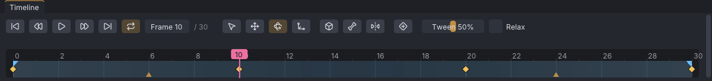

# Interface

The VATs window is a menu bar, six docked panels and a status bar. Panels can be dragged by their
tabs to other places, stacked as tabs, or pulled out as floating windows; VATs remembers the layout
between sessions.

> Related articles: [[First steps]], [[Control presets]], [[Keyboard shortcuts]], [[Preferences]]

*The default layout, with the [[First steps]] example open at frame 10 and **mElbowRight** selected.*

## Layout

| Panel | Default place | Holds |
|---|---|---|
| **Bones** | left | the skeleton as a list, with a filter box and selection buttons |
| **Inventory** | left, a tab beside **Bones** | projects, animations, mesh bodies, props, poses and clips |
| **Viewport** | centre | the avatar, the gizmo, the view cube |
| **Properties** | right | the selected bone or prop, the animation settings, the export settings |
| **Graph** | bottom | the curve editor |
| **Timeline** | bottom, under **Graph** | play controls, the frame box, tool buttons and the frame ruler |

The **status bar** runs along the bottom of the window. On the left it shows what the last command
did, how many items are selected when there is more than one, and **Check: N** when the
[[Animation check]] has found problems. On the right it shows the mouse
controls of the active [[Control presets|control preset]], or the graph's controls while the pointer
is over the **Graph** panel.

The title bar shows the project's file name (`Untitled` before the first save), `*` while there are
unsaved changes, and the VATs version.

## Usage

### Bones

- **Filter bones...** narrows the list to bones whose names contain the text.
- **Select All** selects every visible bone; **Keyed on Frame** selects the bones with a key on the
  current frame; **All Keyed** selects every bone with a key anywhere in the animation.
- **Show** (closed by default) picks which groups of bones are listed and drawn, and has
  **Collision Volumes**. The same switches are in the **View** menu.

A bone with a key on the current frame is listed in amber, a bone animated anywhere in tan, and
attachment points in green. See [[Skeleton]].

### Inventory

**Filter by name...** at the top narrows every section to the items whose names contain the text. Then:

- **Projects** and **Animations**: your `.vat` and `.anim` files, from the library folders, recent
  projects and folders you add ([[Project library]]).
- **Bodies**: your [[Mesh bodies]].
- **Meshes**: the prop library ([[Props]]).
- **Poses**, **Clips** and **Starter poses**: the [[Pose library]].

Drag or double-click an item to use it; right-click it for the rest.

### Viewport

- Click a bone to select it. Clicking the same spot again selects the bone underneath.
- **Shift+click** adds a bone to the selection; a click on empty space clears it (see [[Posing]]).
- Right-click a bone for its body-part menu.
- **Esc** or a right-click during a drag cancels the drag.
- The cube at the top left turns the view: click a face to look from that side, or drag the cube to
  orbit.
- The axis marker at the bottom left shows the world axes.

### Properties

Sections, each of which can be collapsed:

- **Bone** (or **Prop** when a prop is selected): the selection's values and options.
- **Animation**: **Frame rate**, **Last frame**, **Loop**, **Loop in** and **Loop out**, **Priority**,
  **Ease in** and **Ease out**, **Hand pose** and **Expression**. See [[Keys and timeline]],
  [[Animation priority]] and [[Loop tools]].
- **Export**: file naming, folder, bake shape and export buttons. See [[Export to Second Life]].

### Graph

The curve editor for the selected bones. Close it with the **×** on its tab; **Ctrl+G** (**View →
Graph Editor**) shows or hides it. See [[Graph editor]].

### Timeline

From left to right: the play controls, the frame box and the last frame, the tool buttons, the axes
button, **IK / FK** and **Set Key**. Below them is the frame ruler with the keys, the loop and ease
markers and, when loaded, the [[Audio track]]. See [[Keys and timeline]].

*The timeline of the [[First steps]] example: amber diamonds are keys, the small triangles at 6 and
24 the ease markers, and the band from 0 to 30 the loop.*

The play controls are icons only; hover one for its name and key:

| Button | Icon |
|---|---|
| **Go to start** | a bar, then a triangle pointing left |
| **Previous key** | two triangles pointing left |
| **Play / pause** | a triangle pointing right; two bars while playing |
| **Next key** | two triangles pointing right |
| **Go to end** | a triangle pointing right, then a bar |
| **Loop** | two arrows chasing each other; highlighted while **Loop** is on |

The other buttons show an icon and their name: **Select** (an arrow pointer), **Move** (four arrows),
**Rotate** (a circling arrow), **Scale** (a corner with a dot), the axes button (**Local** with a box,
**World** with a globe, **Gimbal** with three axes), **IK / FK** (a bone) and **Set Key** (a diamond with
a plus). Their keys are in the tooltips. The active tool is highlighted. When the **Timeline** panel is too narrow
for the names (a window about 1200 pixels wide), these buttons show their icons only, so the **Tween** slider and
**Relax** stay in view.

### Menus

| Menu | Holds |
|---|---|
| **File** | **New**, **Open...**, **Open Recent**, **Save**, **Save As...**, the imports (BVH, SL `.anim`, retarget, prop / mesh, audio), the exports (`.anim`, BVH), **Quit** |
| **Edit** | **Undo**, **Redo**, keys, resets, copy and paste pose, **Save Clip of Selected Bones...**, **Time**, mirror and flip, **Reverse Animation**, **Preferences...** |
| **Playback** | play, frame and key stepping, start and end |
| **View** | view directions, framing and zoom, **Reset Camera**, **Camera Views**, **Graph Editor**, the bone group switches, **Show Collision Volumes**, **Onion Skin**, **Preview as SL Plays It**, **Body**, **Bones in Front (X-ray)** |
| **Light** | the lighting presets **Flat Noon**, **Three-Quarter Key**, **Rim / Back**, **Dusk** and **Night**, **Studio (Default)**, and **Plain Backdrop**: a grey wall and floor behind the actor that turn with the camera. They are for looking at the animation only; nothing is saved |
| **Select** | **Select All**, **Select Keyed on Frame**, **Select All Keyed**, **Select None**, parent, child and siblings |
| **Tools** | the four tools, the axes, IK and pins, **Clean Up Foot Sliding**, **Loop Tools**, **Hand Poser**, **Dynamics...**, **Idle Layer...**, **Overlap...**, **Ragdoll...**, **Face...**, **Actors (Couples and Groups)...**, **Motion Capture...**, **Animation Check...** |
| **Help** | **Help Contents**, **Controls**, **Welcome**, **About Viewport Avatar Toolset** |

A menu item that cannot be used now is greyed; hover over it to see why. The key shown beside an item
is the key in the active preset.

### Help windows

- **Help → Help Contents** (**F1**) opens this help: contents, search and every page.
- **Help → Controls** lists the mouse controls and every key of the active preset.
- **Help → Welcome** reopens the start window.
- **Help → About Viewport Avatar Toolset** shows the version, licence and credits.

### Worked example: find a key with the panels

[Open the example](example:first-wave.vat), the wave from [[First steps]], and use each panel once:

1. **Bones**: type `Elbow` into **Filter bones...**. The list shrinks to the two elbows and the bones
   above them, both elbows in amber because they have a key on frame 0; click **mElbowRight**.
2. **Viewport**: the rotation gizmo appears around the elbow. Press **F** to frame it.
3. **Properties → Bone**: **Rotation** reads `0.0°  9.0°  91.0°` and **Keyed at this frame**.
4. **Timeline**: press **.** (**Next key**). The frame box reads **Frame 10**, the playhead sits on
   the second diamond, and **Rotation** now reads `0.0°  9.0°  60.0°`.
5. **Graph**: the blue **Rotate Z** curve dips to 60 under the playhead and rises to 110 at frame 20.
6. **Status bar**: the left end says `Opened first-wave.vat (an example: Save As to keep your changes)`
   until the next command; the right end shows the mouse controls of your preset.

## Configuration

- Colour theme, interface size and gizmo size: see [[Preferences]].
- **View → Body** picks the avatar drawn in the viewport: **SL Default**, **SL Default (Male)**,
  **Female**, **Male**, **Skeleton Only**, or a mesh body from your library.
- **View → Camera Views** recalls and stores four camera positions; see
  [[Keyboard shortcuts#Camera views]].

VATs keeps the panel layout in `layout.ini` in the data folder. See
[[Projects and files#Data folders]].

## Troubleshooting

### A panel is missing

Only **Graph** can be closed; **Ctrl+G** brings it back. The other panels can be moved or undocked but
not closed, so a missing one is hidden behind another tab or pushed to a thin edge. To go back to the
default layout, quit VATs, delete `layout.ini` from the data folder and start VATs again.

### Text is too small or too large

Change **Interface size** in [[Preferences]]. VATs also follows the display scale set in the
operating system.

## See also

- [[Control presets]]
- [[Keyboard shortcuts]]
- [[Preferences]]

Category: Interface
