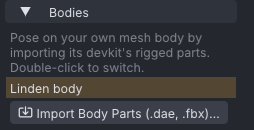
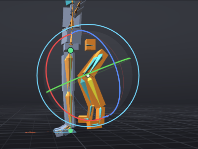

# Mesh bodies

A mesh body is a rigged avatar body from a developer kit ("devkit"), used in Second Life in place of the
Linden body. VATs can show your mesh body in the view and use its joint positions, so IK, pins and the
exported animation fit its proportions. VATs remembers where the devkit files are and never copies,
shares or uploads them.

> Related articles: [[Props]], [[Export to Second Life]], [[IK]], [[Hold and bind]], [[Skeleton]]

> **Note:** In the [[VATs Editor (viewer)]] your body is the avatar you wear, until **View → Body**
> shows an imported body in its place, on your screen only: see
> [[VATs Editor (viewer)#Another body in your avatar's place]]. Imported bodies are also for the other
> actors of a [[Couples and groups|couple or group]], chosen as their **Body** in the **Actors** window.

## Usage

### Import a body

*Before any import: **Linden body** is the only entry, highlighted as the body shown.*

1. Open the **Inventory** and find **Bodies** at the top.
2. Press **Import Body Parts (.dae, .fbx)...** and choose every part at once: body, head, hands and
   feet.
3. VATs checks each part and reports the result in **Imported body** with the parts, their triangle
   counts and any weights to joints it does not know. Parts that cannot be read, or that are not rigged
   to the SL skeleton, are listed under **Left out**.

The body takes the name of the first file and becomes the body shown. An import where no part is usable
reports **No body imported**.

Importing a whole-body mesh with **File → Import Prop / Mesh (.dae, .fbx)...** also works: VATs sees
that it is rigged to most of the skeleton and asks **This Looks Like an Avatar Body**. Choose **Use as
Body**, **Add as Prop** or **Cancel**.

### Switch bodies

- In **Inventory → Bodies**, double-click a body, or **Linden body** to go back. Hover a body to see its
  files.
- **View → Body** lists the Linden shapes (**SL Default**, **SL Default (Male)**, **Female**, **Male**,
  **Skeleton Only**) and, under **Mesh bodies**, your bodies. In the viewer it lists **Your Avatar** and
  your bodies, and a body chosen there shows in your avatar's place.
- Right-click a body for **Use** or **Remove from Inventory**. Removing it does not delete the mesh
  files.

The body shown is a preference, not part of the project.

### Any rigged mesh: creatures too

A body does not have to be a human devkit. Any mesh rigged to the SL skeleton imports the same way, a
creature with its own proportions included, and shows at the size its rig declares.

### Pose on the body's proportions

While a mesh body is shown, the joints and collision volumes sit where the devkit's binds put them. A
devkit with longer legs poses with longer legs, and IK and pins reach the positions the body really
has.

What the view shows does not change the export. To bake IK and pins against the body, set
**Properties → Export → Bake shape** to **Mesh body:** and the body's name; see
[[Export to Second Life#Choose the bake shape]]. In the viewer, a body shown in your avatar's place is
what **Your avatar** bakes on, position keys included.

### Rig axes

A rig made in Blender or another 3D program gives every bone its own axes: one along the bone and two across it,
turned (rolled) the way the rigger chose, so that a knee bends about one of them. Second Life ignores them: its joints
turn in their own fixed frames. VATs keeps the rig's axes, the **rig axes**, and poses in them while the body is
shown:

*The test mech's hind knee with the Rotate tool: the red ring turns the knee about its own hinge.*

- **The Local gizmo** (Rotate and Move, **Local** axes) lines up with the bone's rig axes, so the ring that bends a
  knee is the knee's own hinge, however it was rolled.
- **Properties → Rotation** reads the turn about the rig axes (**In the body's rig axes** shows under it). Typing a
  value turns the bone about its own axes.
- **The bone glyphs** roll with the rig axes. A bone points along its rig bone axis (Y for a Blender rig), as far as
  its child joint; an end bone, such as a foot or a head, as far as its own mesh reaches.
- **[[IK#Auto IK|Auto IK]]** bends elbows, knees and hind legs about their rig hinge.

The keys and the exported `.anim` stay in Second Life's joint frames, exactly as without the body: rig axes only
change how you pose and what you see. **Gimbal** axes still show the stored channels, and the [[Graph editor]] shows
the stored curves.

A file has rig axes when its binds follow a bone orientation, as FBX and COLLADA from Blender do. A file written in
Second Life's frames (many converted kits are) has none, and the gizmo shows Second Life's axes. **View → Body**
chooses which body you pose on; in the viewer, rig axes apply while a body is shown in your avatar's place.

### Export a devkit from Blender

Select the armature and every mesh part, then export FBX with the default settings and **Add Leaf Bones**
off. Import all the parts together, so they share one alignment.

## How VATs reads a devkit

- **Axes.** A devkit exported with other axes is turned upright, and a quarter turn about the vertical
  is applied when the binds clearly call for it. All parts of one body share the same turn, so the eyes
  and head stay on the body.
- **Bone-oriented binds.** FBX and COLLADA files whose binds follow Blender's bone orientation are aligned joint
  by joint, and their bone axes are kept as the body's rig axes (above).
- **Mixed COLLADA.** Blender's COLLADA exporter can write SL bind data for some joints and Blender's own
  positions for others, often the face. VATs corrects each such joint on its own.
- **Weights.** A vertex with more than four weights keeps its strongest four, as in Second Life.

## Troubleshooting

### A part is left out: not rigged to the SL skeleton

The file has no skin, or its joints are not SL bones. Export the part again with the armature selected.

### Face bones on the centre line are slightly off

In COLLADA files, a joint within 1 cm of the centre line, such as `mFaceRoot`, cannot be told apart
from a correctly placed one and stays as written. Export the devkit as FBX instead.

### The body is skinny or wide in places compared to Second Life

The fitted-mesh shape sliders that scale the collision volumes in-world are not modelled; the body is
shown at the devkit's own proportions.

### A body added as a prop does not change the proportions

Only a body in **Inventory → Bodies** shapes the avatar. A body added as a prop follows the Linden
proportions.

### Weights to an unknown joint

The report lists joints the devkit weights to that are not in the SL skeleton. Those vertices do not
move with the animation.

Category: Import and export
