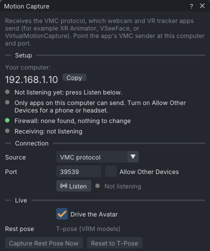
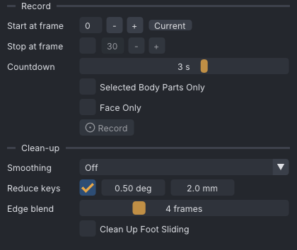

# Motion capture

Motion capture records live body and face motion from a tracking app or suit into the animation. VATs
receives the VMC protocol, Rokoko Studio Live and iFacialMocap over UDP on your local network, shows the
motion on the avatar while it arrives, and records takes as keys.

> Related articles: [[Face tracking]], [[Retargeting]], [[Keys and timeline]], [[VATs Editor (viewer)]]

## Usage

Open the window with **Tools → Motion Capture...**. The window has a **Setup** checklist at the top, then
the **Connection**, **Live**, **Face**, **Record**, **Clean-up** and **Last take** sections.

*Before **Listen**: a grey dot marks what is still to do, a green one what is done. The dot after **Listen** turns amber while VATs waits for a sender and green once packets arrive.*

### Sources

| Source | Default port | Allow Other Devices | Sent by |
|---|---|---|---|
| **VMC protocol** | `39539` | off | webcam and VR-tracker apps, for example XR Animator, VSeeFace and VirtualMotionCapture |
| **Rokoko Studio Live** | `14043` | off | Rokoko suits through Rokoko Studio |
| **iFacialMocap (iPhone)** | `49983` | on | the iFacialMocap app on an iPhone or iPad with Face ID |

Choosing a source sets its default port. A port you typed yourself is kept when you switch source.

### Connecting a VMC app

1. Keep **Source** on **VMC protocol** and **Port** on `39539`.
2. If the tracking app runs on another device, tick **Allow Other Devices**. Off, only apps on this
   computer can send.
3. Click **Listen**.
4. In the tracking app, switch on its VMC sender and point it at the address shown under **Your
   computer** and the same port.

VMC apps send a VRM-style avatar that stands in a T-pose at rest. If the arms or legs come in twisted,
stand in a T-pose and press **Capture Rest Pose Now**. **Reset to T-Pose** drops the captured rest pose.

### Connecting Rokoko Studio

1. Set **Source** to **Rokoko Studio Live**. The port changes to `14043`.
2. In Rokoko Studio, add a **Custom** streaming target with this computer's address, the same port and
   the **JSON v3** data format.
3. Click **Listen**. The actor name appears once data arrives.
4. Stand in a T-pose and press **Capture Rest Pose Now**. Rokoko's joints have their own rest directions,
   so do this every time you connect.

VATs takes the first actor in the stream that has a body. Face and glove data from Rokoko are ignored.

### Connecting an iPhone

See [[Face tracking#Connecting iFacialMocap]]. iFacialMocap sends the face and head only. The window
listens to one source at a time, so record the body in a separate take with a body source.

### The setup checklist

The checklist shows what still stands between the sender and VATs:

- **Your computer**: this computer's address, with **Copy**. Enter it in the sending app, on the same
  Wi-Fi.
- **Listening on port N**, or **Not listening yet: press Listen below.**
- **Other devices can send**, or a button **Allow Other Devices and Listen Again**.
- The firewall state: checking, none found, open, unknown, or probably blocking. When a Linux firewall is
  probably blocking the port, **Allow on My Home Network** opens it for your local subnet only (your
  system asks for your password), and **Copy Command** copies the command to type yourself. On Windows,
  allow VATs under **Windows Security → Firewall & network protection → Allow an app through firewall**;
  on macOS, under **System Settings → Network → Firewall → Options**.
- **Receiving N packets/s from** the sender, or **No data for N s**.

### Watching the motion

In the **Live** section, **Drive the Avatar** (on by default) shows the incoming motion on the avatar
while listening. The clip does not change until you record.

### Recording a take

*The defaults: a take starts at frame 0 after a 3 s countdown, keys are reduced within 0.5° and 2 mm, and the edges blend over 4 frames. **Record** stays grey until data arrives.*

1. Set **Start at frame**. **Current** uses the playhead.
2. Optionally tick **Stop at frame** (default `30`) to record into that range only ("punch in"). Keys
   outside the range are left alone.
3. Set **Countdown** (0–5 seconds, default 3) to get into position.
4. Optionally tick **Selected Body Parts Only** to record only the parts of the selected bones, for
   example new arms over an existing walk, or **Face Only** to record only the face bones (and the head
   from an iPhone). The two are exclusive.
5. Press **Record**. During the countdown, **Cancel** stops it. After the countdown the window shows
   **Recording frame N**; press **Stop** to end the take.

Each take is one undo step. The clip's length grows to fit a take that runs past the last frame. A take
is cancelled if you open or create another document, or switch to another actor (see
[[Couples and groups]]), before it ends.

### Hip movement

A take moves the hips (`mPelvis`) by how far the performer moves away from standing, scaled by the
avatar's hip-to-ankle height over the performer's. Second Life plays that movement from where the avatar
stands, so standing still plays at the avatar's own height.

- Without a captured rest pose, a take starts where you stand when it starts: the hips start with no
  forward or sideways movement, and a step forward moves them forward.
- Height is measured from you standing upright on the floor under your feet. A take that starts in a
  crouch starts with the hips low; the rest of the take is not raised.
- After **Capture Rest Pose Now**, takes measure the hips from where you stood when you pressed it. A take
  that starts a step in front of that spot starts a step forward.
- The live view measures from the captured rest pose, or from where you stood when data first arrived.

### Cleaning up a take

The **Clean-up** settings apply to the next take:

| Setting | Range | Default | Effect |
|---|---|---|---|
| **Smoothing** | **Off**, **Box (average)**, **One-Euro**, **Savitzky-Golay**, **Butterworth** | **Off** | calms tracker jitter; see below |
| **Reduce keys** | degrees, millimetres | on, `0.5` deg, `2.0` mm | removes keys that don't change the motion by more than these amounts |
| **Edge blend** | 0–15 frames | 4 | eases a punched-in take in and out of the animation around it |
| **Clean Up Foot Sliding** | on/off | off | holds planted feet still with leg [[IK]] where the take had them on the ground |

**Smoothing** choices:

- **Box (average)** averages each rotation with its neighbours over a **Box radius** of 1–5 frames. It is
  the filter older versions had; settings saved by them open with it.
- **One-Euro**, **Savitzky-Golay** and **Butterworth** filter the take's curves after it is fitted to the
  skeleton, before key reduction: every rotation curve (degrees) and position curve (metres, such as the
  hips' travel), face bones included. Their settings are the same as in the graph editor's **Filter
  Curves...**; see [[Graph editor#Filtering curves]] for what each one does. The ends of the take are
  padded by reflection.

With one of the three filters, **Last take** also gives the take's shake before and after the filter: the
mean over its bones, the three shakiest bones, and the hips' travel in m/s³ when it has any. Shake is the
RMS of the jerk (the third difference of each curve), in degrees per second cubed.

**Last take** reports what the last take recorded.

## Tips and tricks

- Record the body and the face in separate takes: record the body first, then a **Face Only** take over
  it.
- Use **Stop at frame** with **Edge blend** to replace a few seconds in the middle of a good take.
- VATs redraws continuously only while it is listening. Click **Stop Listening** when you are done, and
  it goes back to using no CPU when idle.

> **Note:** The window's settings are saved in `settings.json` as you change them: source, port, **Allow
> Other Devices**, phone address, **Drive the Avatar**, the face settings, **Countdown** and the
> **Clean-up** section. The start and stop frames, **Selected Body Parts Only** and **Face Only** are
> chosen per take and not saved.

## Troubleshooting

### No data arrives

The sender uses another address or port, or a firewall drops the packets. Check that **Your computer**
matches the address in the sending app and that both use the same port. For a phone or another computer,
tick **Allow Other Devices** and follow the firewall line of the checklist. The phone and the computer
must be on the same network.

### Arms or legs come in twisted

The sender's rest pose differs from VATs'. Stand in a T-pose and press **Capture Rest Pose Now**.

### The take starts away from the avatar

A rest pose was captured at another spot, and takes measure the hips from there. Stand where you will
record and press **Capture Rest Pose Now** again. With the VMC protocol, **Reset to T-Pose** instead makes
each take start where you stand.

### The take was cancelled

The document or the edited actor changed while recording. Record again without switching.

## See also

- [[Face tracking]]
- [[Retargeting]] for recorded files (BVH, glTF, FBX) instead of live streams
- [[VATs Editor (viewer)]]
- [VMC protocol specification](https://protocol.vmc.info/english)

Category: Motion
