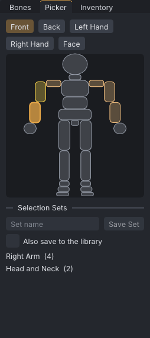

# Picker

The **Picker** tab, beside **Bones**, selects bones by clicking an outline of the avatar instead of finding their names in a list. Below the outline, selection sets keep groups of bones you select often under a name, in the project and optionally in your library.

> Related articles: [[Posing]], [[Skeleton]], [[Hand poser]], [[Face animation]]

## Usage

### Picking body parts

The buttons at the top choose the outline:

| View | Shows |
|---|---|
| **Front** | the body facing you: its right side on your left. Includes **Groin** |
| **Back** | the body from behind: its right side on your right. Includes the wings, **Wings Root** and the tail in three parts |
| **Left Hand**, **Right Hand** | the back of the hand, fingers up: the wrist, and each finger and thumb in three joints |
| **Face** | every face bone: forehead, eyebrows, eyelids, eyes (the system eyes and the **Alt** eyes of mesh heads), ears, nose, cheeks, lips, jaw and chin, with the teeth, tongue and **Jaw Shaper** in a row below |

- **Click** a part to select its bones; the selection is replaced. **Shift+click** adds them to the selection.
- A **Wing** part selects the whole wing (`mWing1` to `mWing4` and `mWing4Fan`); each tail part selects two tail bones. Every other part is one bone.
- Hover a part to see its name and bones. A part whose bones the skeleton does not have is drawn faint and cannot be clicked.
- Selected parts are filled with the accent colour. The last bone picked is the primary bone, as in [[Posing#Selecting bones]].

Parts are coloured by what their bones hold at the current frame, like the rows of the **Bones** tab:

| Colour | Meaning |
|---|---|
| light blue | pinned at this frame (see [[Hold and bind]]) |
| violet | its limb is in [[IK]] at this frame |
| amber | keyed at this frame |
| tan | keyed somewhere in the animation |
| grey | not animated |

When several apply, the first in the table wins.

*Frame 24 of the example with **mElbowRight** selected: the forearm in the accent colour, the keyed arm amber and tan.*

### Selection sets

1. Select the bones, in the picker, the view or the **Bones** tab.
2. Type a name in the **Set name** box and press **Save Set**. A set with the same name is replaced.
3. Tick **Also save to the library** first to keep a copy for every project.

The project's sets are listed under **Selection Sets**, each with its number of bones. Click a set to select its bones; **Shift+click** adds them. Bones the skeleton does not have are skipped. Right-click a set for:

- **Add Selected Bones** and **Remove Selected Bones**: change the set to include or leave out the bones selected now.
- **Save to Library**: copy the set to the library.
- **Delete Set**.

Saving, changing and deleting a project's set are each one undo step, and the sets are saved with the project. In a [[Couples and groups|group scene]] each actor has its own sets.

Library sets are listed under **Library** once there is one. Click one to select its bones; right-click for **Add to Project** and **Delete from Library**. They are kept in `selection_sets.json` beside the pose library, and changes to them are not undone by **Undo**.

[Open the example](example:blocking-arm.vat)

The example has two sets, **Right Arm** and **Head and Neck**.

## Troubleshooting

### Clicking a part selects nothing

The part is faint: the skeleton has none of its bones. With a skeleton that lacks Bento bones, the face and finger parts are faint.

### The Picker tab is missing

The tab opens beside **Bones** the first time. If it was dragged away, drag its title back onto the **Bones** tab. The command line's `--window picker` brings it to the front.

## See also

- [[Posing]]
- [[Skeleton]]

Category: Animating
