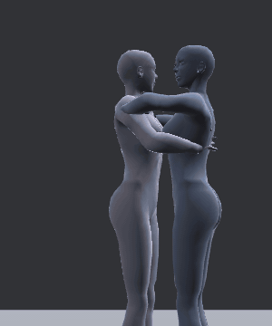
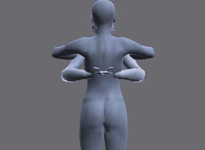

# A hug for two

An advanced tutorial: two avatars hug and rock gently from side to side. You fix the arms where they pass through
each other, keep every hand on the other body while it moves, and export both animations with the lines a sit
system (AVsitter or nPose) needs to seat the pair. It assumes you have done the beginner and routine tutorials on
the [[Tutorials]] page.

> Related articles: [[Couples and groups]], [[Hold and bind]], [[Animation check]], [[Export to Second Life]]

## What you will make


*The finished hug: Lead's hands low on Partner's back, Partner's arms over Lead's shoulders, both heads turned aside.*

Two actors, **Lead** and **Partner**, stand 0.3 m apart, facing each other. Both reach in by frame 14 and close the
hug by frame 24; from 24 to 84 the hug loops while Partner rocks. The start of the tutorial already has the poses,
blocked the way a first pass usually is, and three problems a beginner would not see at first:

- Lead's wrists cross inside each other behind Partner's back.
- The arms are keyed with their own angles, so when Partner rocks, Lead's hands stay where they were and slide
  over Partner's back instead of moving with it.
- The heads meet face to face, where real people turn aside.

[Open the example](example:hug-start.vat)

## Steps

### 1. Look at the problem

1. Open the start example with the button above. Choose **Tools → Actors (Couples and Groups)...**: the list shows
   **Lead (you)** and **Partner**, and **Lead (you)** is highlighted, so you are editing Lead.
2. Press **Space** to play, and watch Lead's hands on Partner's back from frame 24 on. Partner sways from side to
   side (the waist 7° and the chest 4° more each way), and the hands stay put while the back moves under them.


*Before the fix: seen from behind Partner, the hands keep their own place while the back sways under them.*

> **Why:** a hand keyed by its arm's angles (forward kinematics, FK) knows only its own shoulder. Nothing in those
> keys says "on Partner's back". Contact between two bodies has to be made a rule, not a coincidence of angles:
> that is what a bind does (step 4).

### 2. Check where the body passes through itself

The status bar shows **Check: 1** in blue: the [[Animation check]] has a finding.

1. Choose **Tools → Animation Check...**, or click the badge. The finding reads "mWristLeft and mWristRight pass
   4.8 cm into each other (their capsules: a hint, not the mesh)".
2. Look at the timeline: short red lines along its foot mark the frames of the finding, from 16 on. On those
   frames both wrists are drawn red in the view.
3. Press **Go to Frame 16** to see the first one, then **Fix**. The fix is **Push Out**: on each listed frame it
   moves the hands apart through the arm's IK, by the overlap and 5 mm more. The window then says "No problems
   found."
4. Click **Partner** in the **Actors** window and do the same for it: its finding reads "mWristLeft and
   mWristRight pass 2.7 cm into each other"; press **Fix**.


*Lead's crossed wrists. A blue ring means Info: often a mistake, sometimes meant.*

> **Why:** in a hug the arms are close to the other body and to each other, and it is easy to key a pose that
> looks right from the front while a hand is buried in the other hand, or in your own hip. The check measures
> simple rods (capsules) round each bone, not the mesh, so read it as "look here", and judge in the view.

> **Note:** the check looks at the actor you are editing. It does not compare one actor's body with the other's;
> judge the contact between the two by eye, from several views (**1**, **3** and **7** in the Industry preset).

### 3. Turn the heads aside

1. With **Lead (you)** highlighted in the **Actors** window, type `mHead` in the filter at the top of the **Bones**
   tab and click **mHead**.
2. Go to frame `0` (type it in the **Frame** box on the timeline bar and press **Enter**), point at the view and
   press **S** (**Edit → Set Key**). The status bar says "Keyed 1 item(s) at frame 0": the head is keyed straight
   ahead, so it only starts to turn after this frame.
3. Go to frame `18`. In **Properties → Bone**, double-click the third **Rotation** field (Z), type `30` and press
   **Enter**. The head turns to Lead's left and the frame is keyed.
4. Click **Partner** in the **Actors** window and repeat: **mHead**, **S** at frame 0, Rotation Z `30` at frame 18.

> **Why:** faces never meet in a hug; each head turns to one side so the cheek rests past the other's shoulder.
> Small turns sell a pose: 30° is enough to read from any camera, and it starts before the hug closes, so the head
> leads and the arms follow.

### 4. Keep the hands on the other body

Bind each hand to the other actor's chest from the frame the hug closes. A bind is a pin on another actor's bone
(see [[Hold and bind]]): the hand keeps the distance and angle it has now from that bone, whatever the bone does.

1. Click **Lead (you)** in the **Actors** window. Go to frame `24`.
2. Select **mWristRight** (type it in the **Bones** filter and click it).
3. In the **Actors** window, scroll down to **Contact with another actor**. **Other actor** already reads
   **Partner**. Open **Their bone** and choose **mChest**, near the top of the list.
4. Press **Bind Selected Point to This Bone from Here**. The status bar says "mWristRight now follows Partner's
   mChest"; **Properties → Bone** says **Pinned to mChest from frame 24**, and the **Bones** tab shows
   **mWristRight [pinned]** in light blue.
5. Select **mWristLeft** and press **Bind Selected Point to This Bone from Here** again (**Their bone** keeps
   **mChest**).
6. Click **Partner** in the **Actors** window. **Other actor** now reads **Lead**. Bind Partner's **mWristRight**
   and **mWristLeft** to Lead's **mChest** the same way, at frame 24.
7. Play. Lead's hands now rock with Partner's back, and the elbows bend and open to follow.

> **Why:** contact is the thing people notice first in a couples animation. A hand that floats a centimetre off a
> shoulder, or sinks into it, reads as fake even to someone who couldn't say why. A bind makes contact a rule, so
> you can go on changing the bodies (retime them, turn them, make them rock more) and the hands stay on.

> **Tip:** bind from the frame the hands arrive, not from frame 0: before the bind, the arms travel on their own
> keys. To end a bind, go to the frame and use **Tools → Release from Here** with the hand selected.

### 5. Name the export and read the sit-system lines

1. Choose **File → Export SL .anim...**. Type `Hug` in **Name** and press **Enter**. Further down, **Saves as**
   lists `Hug_01_Lead.anim`, `Hug_01_Partner.anim` and `Hug_01_placement.txt (where each actor stands)`. Close the
   dialog with its **×** for now.
2. In the **Actors** window, scroll to **Sit systems (furniture)**. **Sit target (m)** and **Rotation (deg)** are
   at 0, so the lines give each actor's placement as it is.

The AVsitter2 lines read:

```
SITTER 0|Lead
SYNC Hug_01|Hug_01_Lead
{Hug_01}<0,0,0><0,0,0>

SITTER 1|Partner
SYNC Hug_01|Hug_01_Partner
{Hug_01}<0.3,0,0><0,0,180>
```

and the nPose V4 lines:

```
XANIM|1|Hug_01_Lead|<0, 0, 0>|<0, 0, 0>
XANIM|2|Hug_01_Partner|<0.3, 0, 0>|<0, 0, 180>
```

3. Press **Copy** under the format your furniture uses, or **Save as .txt...** to keep the lines in a file.


*Partner sits 0.3 m in front of Lead, turned 180° to face it.*

> **Why:** in Second Life each avatar plays its own animation around its own seat. The animations only line up if
> the furniture seats the two avatars exactly where they stood in VATs, so the offsets travel with the files.

### 6. Export both sides

1. Choose **File → Export SL .anim...** again, press **Export SL .anim** and choose a folder when asked.
2. VATs writes three files: `Hug_01_Lead.anim`, `Hug_01_Partner.anim` and `Hug_01_placement.txt`. The placement
   note lists each actor's offset and rotation, an `llSitTarget` line for each, and the same AVsitter2 and nPose
   V4 lines as step 5.
3. Save the project with **File → Save As...**.

## Check your result

[Open the example](example:hug-finished.vat) to compare with the finished hug.

| Where | What to look for |
|---|---|
| **Animation Check**, for each actor | "No problems found." |
| **Bones** tab, each actor | **mWristLeft [pinned]** and **mWristRight [pinned]** |
| **Properties → Bone**, a wrist at frame 30 | **Pinned to mChest from frame 24** |
| **mHead** at frame 18, each actor | Rotation `0.0°`, `0.0°`, `30.0°` |
| **Properties → Animation** | Last frame `84`, **Loop** on, Loop in `24`, Loop out `84`, Priority `4` |
| Export folder | `Hug_01_Lead.anim` and `Hug_01_Partner.anim`, about 3 KB each, and `Hug_01_placement.txt` |
| Playing | From frame 24 on, every hand moves with the back it rests on |

## Troubleshooting

### Bind Selected Point to This Bone from Here is greyed out

No bone is selected. Select the wrist first, in the **Bones** tab or the view.

### The hand jumps when the bind starts

The bind keeps the hand where it is at the frame you bind from. If the hand was not yet on the back at that frame,
it stays off it. Undo (**Ctrl+Z**), go to the frame where the hand touches, and bind from there.

### The finding comes back after Fix

**Push Out** keys only the frames the finding lists; the frames round them can still overlap a little once the
curves change, and the check then lists those. Press **Fix** again. A bind holding the hand wins over the new
keys, so fix the arms before you bind them (step 2 before step 4).

### Partner's finding does not show

The check and its badge follow the actor you edit. Click **Partner** in the **Actors** window.

### The lines say hug-start_01

The export **Name** is empty, so the pose name comes from the project file's name. Set **Name** in **File →
Export SL .anim...** (step 5).

Next: [[Dance to the beat]]

Category: Getting started
