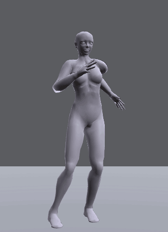
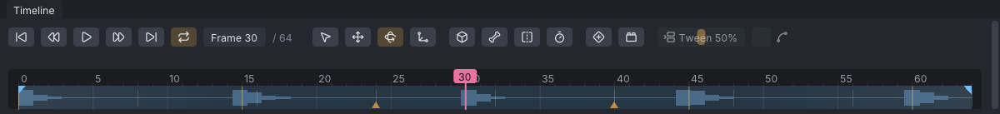
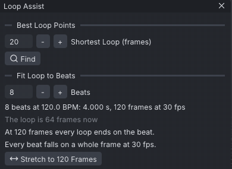
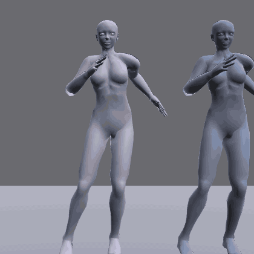
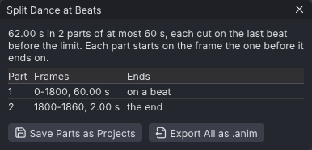

# Dance to the beat

An advanced tutorial: a step-touch groove put on the beat of a song, then loosened with follow-through so it stops
looking stiff. You load music, mark its beats, fit the loop to four beats, let the arms and head trail behind the
body, and learn how a dance longer than a minute goes to Second Life in parts. It follows [[A hug for two]].

> Related articles: [[Audio track]], [[Loop tools]], [[Overlap]], [[Dynamics]], [[Time editing]]

## What you will make

*The finished groove: the hips drop and the free foot taps on each beat; the forearms, hands and head follow a moment behind.*

A 2-second loop at 30 fps: four beats of a 120 BPM song. On each beat the knees bend, the hips drop and sway over
one foot while the other foot taps out to the side, the chest sways the other way, one arm pumps forward and the
other back, and the head nods; the side changes every beat. Both legs are in [[IK]], so the feet stay where they are
put. The start already has the moves, keyed the way a first pass usually is:

- the loop is 64 frames, a little slower than the music, so it drifts off the beat;
- every bone moves on the same frames, so the whole body goes at once, like a puppet.

[Open the example](example:dance-start.vat)

You need a song or a click track with a steady beat at 120 BPM (a WAV, MP3, FLAC or Ogg Vorbis file). The numbers
below hold for any 120 BPM track; the audio never goes into the exported `.anim` (see [[Audio track]]).

## Steps

### 1. Load the music and set the beat grid

1. Open the start example. Choose **File → Load Audio...** and pick your track. The status bar says its name and
   length, for example "Loaded click_track.wav (4.0 s)", and the waveform appears along the timeline.
2. Right-click the timeline. In the menu's **Audio** section, **Ctrl+click** the **BPM** field (it reads `off`),
   type `120` and press **Enter**.
3. With the playhead on frame 0, open the menu again and choose **Beat Grid Starts Here**, then tick **Snap to
   Beats**.
4. Grid lines appear every 15 frames: at 120 BPM a beat is 0.5 s, which is 15 frames at 30 fps.

*Each click of the track sits on a grid line.*

If the song's own beat does not sit on the lines, **Ctrl+drag** the timeline to slide the audio until it does, or
set **Start (s)** in the same menu.

> **Tip:** don't know the BPM? Play the animation and press **B** on each beat: every press adds a beat marker
> (**Mark a Beat Here**). Count the markers over 15 seconds and multiply by 4.

> **Why:** dancers hit poses *on* the beat and travel between beats. When the key poses (the hips at their lowest,
> the arms at full reach) land on the grid, the eye reads the dance as musical, even with the sound off.

### 2. Fit the loop to four beats

[Open the example](example:dance-grid.vat)

To start here, open this example: the groove with the beat grid of step 1 already set (load your track to hear it).

1. Play. The first bounce lands on the grid, but the loop is 64 frames and four beats are 60, so each repeat
   drifts 4 frames later.
2. Choose **Tools → Loop Tools → Fit Loop to Beats...**. The **Loop Assist** window opens at **Fit Loop to Beats**.
3. Press **-** beside **Beats** until it reads `4`. The window says "4 beats at 120.0 BPM: 2.000 s, 60 frames at
   30 fps", "The loop is 64 frames now" and "At 60 frames every loop ends on the beat."
4. Press **Stretch to 60 Frames**. The status bar says "The loop is now 4 beats long"; **Properties → Animation**
   reads Last frame `60`, Loop out `60`.

*Four beats at 120 BPM are exactly 60 frames, so the loop never drifts.*

> **Why:** a looping dance plays for minutes in Second Life. A loop that is 4 frames long drifts a whole beat
> every four repeats; one that is a whole number of beats stays on the music for ever.

### 3. Put the keys back on whole frames

Stretching 64 frames into 60 moved some keys between frames (the key at 8 is now at 7.5). The status bar shows an
amber **Check: 1**.

1. Click the badge. The [[Animation check]] says "132 keys sit between whole frames; SL plays whole frames only and
   never shows them".
2. Press **Fix** (**Snap Keys to Whole Frames**). The window says "No problems found."

> **Why:** Second Life samples your animation on whole frames. A key at 7.5 is never shown; its pose is guessed from
> the frames round it. Snapping puts every pose you made where it will actually play.

### 4. Make the arms follow through

Right now the upper arm, forearm and hand all start and stop together. In a real body the hand is carried by the
forearm, which is carried by the upper arm, so each part moves a moment after the one it hangs from.

1. Choose **Tools → Overlap...** (the window is pictured on the [[Overlap]] page). Select **mShoulderLeft**
   (type it in the **Bones** filter and click it). The **Chain** line lists `mShoulderLeft`, `mElbowLeft`,
   `mWristLeft`.
2. **Ctrl+click** **Delay**, type `2` and press **Enter**. Leave **Bones** at `3` and **Falloff** at `1.00`.
3. Press **Apply Overlap**. The status bar says "Overlap applied down 3 bones".
4. Select **mShoulderRight** and press **Apply Overlap** again.
5. Play and watch a hand: it arrives two frames after the forearm, which arrives two after the upper arm.

*Before (left, all at once) and after (right, each part two frames behind the one above it, the head on a spring).*

[Open the example](example:dance-compare.vat) to play the two side by side: the actors **Before** and **After**
dance the groove before and after steps 4 and 5.

> **Why:** this is *overlapping action* and *follow-through*, two of the oldest rules of animation. Parts that
> hang loose (hands, a head, hair, a tail) are dragged by what they hang from, so they start late, overshoot a
> little and settle late. Without it, motion looks like a puppet on one string.

### 5. Let the head trail with dynamics

The head could get the same treatment, but a simulation gives it a softer, springier lag.

1. Choose **Tools → Dynamics...**. Select **mNeck** and press **Add Chain from Selected Bone**. The list shows
   `mNeck +2`: the neck, the head and the skull.
2. Press **Overlap** to load that preset: **Stiffness** `0.300`, **Damping** `0.350`, **Gravity** `0.00 g`.
3. Tick **Preview while playing** if it is off, and play: the head now lags a little behind each twist of the
   chest and settles.
4. Press **Bake**. The status bar says "Baked mNeck to keys" and the list reads `mNeck +2  (baked)`.

> **Why:** [[Overlap]] shifts keys you already have; [[Dynamics]] simulates a spring, so the lag grows and shrinks
> with how hard the body moves. Use overlap for limbs you want to control exactly, dynamics for loose parts.
> Second Life plays keys, not physics, so a simulation always has to be baked.

> **Tip:** for a looser head, set **Stiffness** lower (try `0.15`) and press **Re-bake**. Re-bake starts again from
> the unbaked keys, so try as many settings as you like.

### 6. Split a long dance at the beats

Second Life refuses animations over 60 seconds. A full song goes up as parts that a dance HUD plays one after the
other, and each part should end on a beat so the switch is not heard in the motion.

[Open the example](example:dance-long.vat)

1. Open the long example: the same groove, 31 times over, 62 seconds. **Properties → Animation** shows the length
   in red, "62.00 s: over SL's 60 s limit".
2. Choose **Tools → Split Dance at Beats...**. The window says "62.00 s in 2 parts of at most 60 s, each cut on the
   last beat before the limit", and lists part 1, frames `0-1800`, `60.00 s`, ending **on a beat**, and part 2,
   frames `1800-1860`, `2.00 s`, ending at **the end**.
3. Press **Export All as .anim** to write the parts with the names from **File → Export SL .anim...**, or **Save
   Parts as Projects** to keep editing them (save the project first; the example opens untitled).

*The long dance cut at 60 s, which falls on a beat at 120 BPM.*

## Check your result

[Open the example](example:dance-finished.vat) to compare with the finished groove.

| Where | What to look for |
|---|---|
| **Properties → Animation** | Last frame `60`, **Loop** on, Loop in `0`, Loop out `60`, Priority `4` |
| Timeline right-click menu, **Audio** | **BPM** `120.0`, **Snap to Beats** ticked |
| **mPelvis** keys | the lowest points (**Offset (m)** Z `-0.070`) at frames 0, 15, 30, 45 and 60, on the grid lines |
| **Animation Check** | "No problems found." |
| **Dynamics** | `mNeck +2  (baked)` |
| Playing | each hand arrives about 4 frames after its upper arm; the head lags the chest a little |

The example carries the beat grid but no sound; load your track with **File → Load Audio...** to hear it.

## Troubleshooting

### Beat Grid Starts Here is greyed out

It needs a **BPM**. Set the BPM first (step 1).

### "Needs a BPM" in the Loop Assist window

**Fit Loop to Beats** reads the audio track's **BPM**. Load audio and set its BPM in the timeline's right-click
menu.

### Apply Overlap is disabled

No bone is selected, or a bone of the chain is in a limb that uses [[IK]]; the reason is shown beside the button.
Switch that arm to FK first.

### The status bar says "Audio not found"

The project remembers the audio file by its path; it has moved, or (in the examples) there is none. Load it again
with **File → Load Audio...**.

### The head stops following after I change the dance

A bake follows the animation it was baked from. After changing the body, press **Re-bake** in **Tools →
Dynamics...**.

Next: [[The polish pass]]

Category: Getting started
