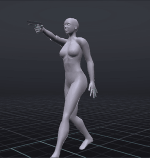
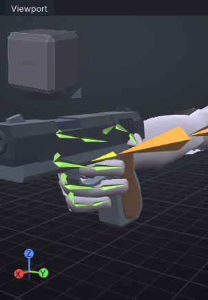
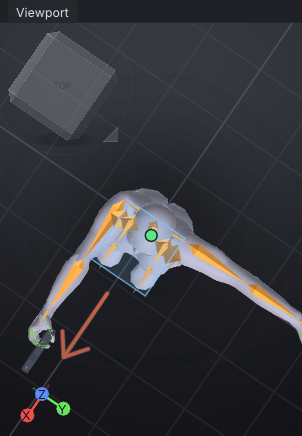
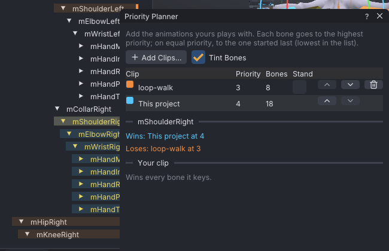
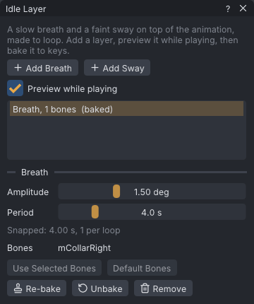

# One-handed gun hold

A routine tutorial: a one-handed pistol hold that plays on top of the wearer's AO, so they can walk and run
with the gun raised. You key the right arm and hand only, pick the priority that lets the hold win those bones,
grip the starter **Pistol** with a starter hand shape, line the arm up on the aim, and make two versions: a
static hold and one that breathes. It assumes the Beginner tutorials: you can select a bone, type rotation
values and play the timeline.

> Related articles: [[Animation priority]], [[Priority planner]], [[Props]], [[Pose library]], [[Idle layer]], [[Clips]]

## What you will make

*The hold over a walk, as Second Life combines them: the hold wins the right arm, the walk keeps everything else.*

A one-second loop at priority 4 that keys 18 bones: the right shoulder, elbow and wrist, and the 15 finger
bones of the right hand. Nothing else. The GIF plays [Open the example](example:pistol-over-walk.vat), a
preview made for this page: the help's loop walk with this hold's keys on the right arm.

## Usage

### 1. Start a new project and set the playback settings

Press **Ctrl+N** (**File → New**). In **Properties → Animation** set:

| Field | Value |
|---|---|
| **Loop** | ticked |
| **Priority** | `4` |
| **Ease in** | `0.3` |
| **Ease out** | `0.3` |

Leave **Last frame** at 30: a static hold needs no length, but the loop must be longer than **Ease in** plus
**Ease out** (the **Animation Check** says `The loop (1.00 s) is shorter than ease in plus ease out (1.60 s)`
with the default 0.8 s eases).

> **Note:** **Why priority 4.** AO walks, runs and stands usually play at priority 2 or 3. For each bone, Second
> Life plays the animation with the higher priority (see [[Animation priority#How priorities stack per bone]]). At
> 4 the hold wins the arm against the AO; at 3 it would tie, and the AO, restarted each time you change from
> standing to walking, would win the tie. 5 and 6 are treated as 4 by some viewers, so they buy nothing.

### 2. Put the pistol in the right hand

Open the **Inventory** tab, scroll to **Meshes → Starter props → Weapons** and double-click **Pistol**. The status
bar says `Added Pistol on Right Hand`, and **Properties → Prop** shows **Parent** **Right Hand**, **Position**
`0.005`, `-0.069`, `-0.035` and **Rotation** `-90.0°`, `0.0°`, `-90.0°`: the grip the starter prop comes with.

The pistol is a prop: it shows in VATs and saves with the project, but it is not part of the exported
animation. In Second Life the wearer wears their own gun on the **Right Hand** attachment point, and it moves
with the hand (see [[Props]]).

### 3. Close the hand on the grip

In the **Inventory**, scroll to **Starter poses** and **Shift+click** **Grip (Cylinder)**. The status bar says
`Applied Grip (Cylinder) at frame 0 (mirrored)`: a plain click would pose the left hand; **Shift+click** poses the
right. The fingers of the right hand close round a cylinder, keyed at frame 0.

> **Tip:** The Inventory's filter box finds poses and props by name: type `grip`. Typing `pistol` also finds
> the starter hand pose **Pistol (Finger Gun)**, a pointing gesture, not a grip.

Adjust single fingers with the [[Hand poser]] (**H**) if the grip needs it: drag a finger's dot down to curl it,
double-click it to straighten it.

### 4. Raise the arm onto the aim line

Key the right arm at frame 0. In the **Bones** tab, type the name in **Filter bones...**, click the bone, then
type each **Rotation** box in **Properties → Bone**:

| Bone | Rotation (X, Y, Z) |
|---|---|
| **mShoulderRight** | `0`, `0`, `90` |
| **mElbowRight** | `0`, `-90`, `0` |
| **mWristRight** | `0`, `0`, `0` |

The shoulder turns the arm 90° forward, level at shoulder height; the elbow turns the forearm thumb-up so the
pistol stands upright; the wrist is keyed at rest.

*The grip: the pistol in line with the forearm.*

Press **7** (**View → Top**). Shoulder, elbow, wrist and barrel make one straight line pointing along the red
arrow on the ground, the avatar's forward direction.

*From above: the aim line.*

> **Note:** **Why a straight line.** A one-handed aim reads as an aim when the arm is a straight line from the
> shoulder through the hand to the target. A bent elbow or a wrist cocked up or down breaks the line and the
> gun points somewhere else. The wrist is keyed at 0 on purpose: without a key, the AO's wrist motion would play
> and tip the gun off the line.

### 5. Leave everything else unkeyed

Click **All Keyed** in the **Bones** tab: 18 bones are selected, the right arm and the finger bones of the right
hand. Nothing on the hips, legs, spine, head or left arm.

In VATs the left arm stays out to the side (the rest pose) because nothing moves it. That is expected: in Second
Life those bones are not in the file, so the AO keeps moving them.

> **Note:** **Why so few bones.** An `.anim` claims every bone it has keys for, for its whole length (see
> [[Animation priority#Know which bones an animation claims]]). Key the legs and the walk stops; key the
> spine and the walk's torso twist stops. The fewer bones the hold keys, the more of the AO shows through.

Check it against a walk:

1. Choose **Tools → Priority Planner...** and press **Add Clips...**.
2. Pick `loop-walk.vat` from the help's examples folder (`share/viewport-avatar-toolset/help/examples/` in the
   VATs folder), a walk at priority 3.
3. Select **mShoulderRight**. The planner says `Wins: This project at 4` and `Loses: loop-walk at 3`, and under
   **Your clip**, `Wins every bone it keys.`

*The hold against a walk. In the **Bones** list, the legs take the walk's colour and the right arm the hold's.*

### 6. Save the static hold

Press **Ctrl+S** and name the project `pistol-hold`. This is the first version: one pose, looping. The avatar
holds the gun perfectly still, which reads well while walking or running, where the AO moves everything else.

### 7. Make a breathing hold

Standing still, a perfectly frozen arm looks dead. A second clip adds a slight rise and fall.

1. Choose **Tools → Clips (AO Sets)...**. The table lists one clip, `Clip`. Press **Rename**, type `hold` and press
   **Enter**. Press **Duplicate**: a clip `hold 2` appears with the same keys and becomes the current one. Press
   **Rename**, type `breathing` and press **Enter**. Close the window.
2. In **Properties → Animation** set **Last frame** to `120` and **Loop out** to `120` (4 seconds; **Loop out** does
   not follow **Last frame** by itself).
3. Choose **Tools → Idle Layer...** and press **Add Breath**. The list shows `Breath, 2 bones`: by default it
   moves `mChest` and `mTorso`.
4. Select **mCollarRight** in the **Bones** tab and press **Use Selected Bones**. **Bones** now reads `mCollarRight`.
5. Tick **Preview while playing** and press **Space**: the shoulder rises and settles once every 4 seconds, and
   the gun with it.
6. Press **Bake**. The status bar says `Baked the idle layer to keys`, and the list reads `Breath, 1 bones  (baked)`.

*The breath on the collar bone, baked.*

> **Note:** **Why the collar and not the chest.** The default breath moves the chest and torso, which would add
> two more bones to the file and take the walk's torso motion away. On the collar bone it moves only the arm,
> by 1.5°, and costs one bone.

### 8. Export

Press **Ctrl+S**, then **File → Export All Clips (.anim)**, and pick a folder when asked. You get two files,
`pistol-hold_01_hold.anim` and `pistol-hold_01_breathing.anim`. Use the static hold for walking and running and
the breathing one for standing; see [[Export to Second Life]] and [[Clips]].

## Tips and tricks

- **Hand pose** in **Properties → Animation** is Second Life's built-in hand shape for avatars without Bento
  hands. The finger keys drive Bento hands; set **Hand pose** to **Fist Right** as well if the hold should also
  close a system hand.
- A low-ready variant (the gun pointing at the ground ahead) is the same arm with the shoulder lowered: on a
  third clip, set **mShoulderRight** to `40`, `0`, `90`: the arm and the barrel tip 40° down. Add the head (**mHead** Z `-5`) only if you want the
  eyes on the sights; it costs the AO's head motion.
- To see what Second Life will do with the file, tick **View → Preview as SL Plays It**: the window reads
  `843 bytes, 18 bones, 36 rotation and 0 position keys` for the static hold.

## Check your result

[Open the example](example:pistol-hold.vat): the static hold.

1. **Properties → Animation**: **Loop** ticked, **Priority** 4, **Ease in** and **Ease out** 0.30 s, **Last frame** 30.
2. Select **mShoulderRight**: **Rotation** `0.0°`, `0.0°`, `90.0°`, **Keyed at this frame**, **Priority** **Clip (4)**.
3. **All Keyed** selects 18 bones.
4. The status bar shows no **Check**.

[Open the example](example:pistol-hold-breathing.vat): both clips, opening on `breathing`. In **Tools → Idle
Layer...** the list reads `Breath, 1 bones  (baked)`; **Last frame** and **Loop out** are 120.

## Troubleshooting

### The gun points up at the sky or sideways

The forearm is not turned: check that **mElbowRight** reads `0`, `-90`, `0`. The elbow's Y value turns the
forearm about its length, and the gun with it; its Z value would bend the elbow instead.

### Grip (Cylinder) closed the left hand

It was a plain click. **Ctrl+Z**, then **Shift+click**, or right-click the pose and choose **Right Hand**.

### The legs stop walking in Second Life

The file keys the legs. Click **All Keyed**: if bones other than the right arm and hand are selected, select
them and press **Delete** on every frame they are keyed at (**.** steps to the next key), then export again.

### The AO still moves the arm

The AO plays the arm at 4 or more and started later. Raise **mShoulderRight**, **mElbowRight** and **mWristRight**
to their own **Priority** 5 in **Properties → Bone**, knowing some viewers read 5 as 4.

### The breath does nothing

**Loop out** is still 30, so the layer fits one breath into the first second only, or the layer was never
baked. Set **Loop out** to 120, then **Re-bake**.

## See also

- Previous: [[Tutorials]]
- Next: [[Two-handed rifle hold]]
- [[Animation priority]]
- [[Priority planner]]
- [[Idle layer]]

Category: Getting started
