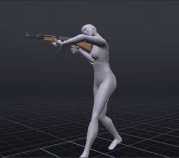
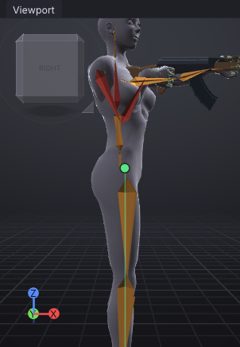
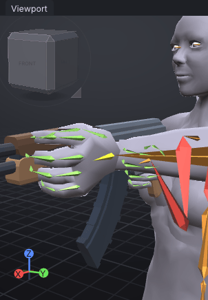
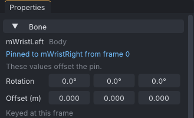

# Two-handed rifle hold

A routine tutorial: a two-handed rifle hold that plays on top of the wearer's AO, in two versions, an aim with
the stock in the shoulder and a ready hold with the muzzle down. The right hand holds the grip, the left hand is
bound to it on the fore-grip, so you pose one arm and both follow. It builds on [[One-handed gun hold]]: the
same priority, the same idea of keying only the bones the hold needs.

> Related articles: [[Hold and bind]], [[IK]], [[Animation priority]], [[Clips]], [[Props]]

## What you will make

*The aim hold over a walk, as Second Life combines them.*

Two one-second loops at priority 4, `aim` and `ready`, each keying 37 bones: **mChest**, both arms and the finger
bones of both hands. The GIF plays [Open the example](example:rifle-over-walk.vat), a preview made for this
page: the help's loop walk with the aim hold's keys on the chest and arms.

## Usage

### 1. Start the project

Press **Ctrl+N** and set **Properties → Animation** as for the pistol: **Loop** ticked, **Priority** `4`, **Ease
in** `0.3`, **Ease out** `0.3`.

In the **Inventory**, double-click **Rifle** under **Meshes → Starter props → Weapons**: `Added Rifle on Right
Hand`. Then, under **Starter poses**, **Shift+click** **Grip (Cylinder)** for the right hand and click it once more
without Shift for the left hand.

> **Note:** **Why priority 4, again.** The hold must win the arms and chest from the AO's walk, run and stand
> (usually 2 or 3); see [[One-handed gun hold]] and [[Animation priority]].

### 2. Turn the chest

Select **mChest** and set **Rotation** to `0`, `0`, `-30`. The shoulders turn 30° to the avatar's right; the
hips do not move.

> **Note:** **Why only the chest.** Shooters stand bladed, the support shoulder forward, so the left arm can
> reach along the rifle. Turning **mChest** does that and leaves **mPelvis** and **mTorso** to the AO, so the
> walk's hip swing and twist still show.

### 3. Put the stock in the shoulder

Key the right arm at frame 0:

| Bone | Rotation (X, Y, Z) |
|---|---|
| **mShoulderRight** | `107`, `-24`, `24` |
| **mElbowRight** | `0`, `0`, `128` |
| **mWristRight** | `-2`, `16`, `-63` |

Press **3** (**View → Right**). The rifle is level at shoulder height and points straight forward, with its stock
against the right shoulder and the right elbow down.

*The finished aim hold from the right: after the next two steps both hands are on the rifle.*

> **Note:** **Why the shoulder.** The stock in the shoulder and the cheek over it put the sights in front of the
> eye; a rifle held out at arm's length, like a pistol, reads wrong at once. The elbow tucked down keeps the
> shoulders relaxed.

The **Check** in the status bar lists a few blue **i** hints, for example `mTorso and mShoulderRight pass 8.6 cm
into each other`: the tucked arm touches the torso's collision capsules. They are hints (**a hint, not the
mesh**), not errors; the arm stays outside the body mesh.

### 4. Put the left hand on the fore-grip

Key the left arm at frame 0:

| Bone | Rotation (X, Y, Z) |
|---|---|
| **mShoulderLeft** | `6`, `3`, `-58` |
| **mElbowLeft** | `0`, `0`, `-60` |
| **mWristLeft** | `-113`, `-84`, `172` |

The left fist closes round the rifle's fore-grip, under the barrel in front of the magazine.

*The support hand on the fore-grip.*

> **Tip:** The values above are exact for the starter **Rifle** on the default body. On another rifle, place the
> hand by eye instead: select **mWristLeft**, press **K** to switch the left arm to [[IK]], and drag the target
> cube onto the fore-grip with the **Move** tool (**W**). The shoulder and elbow bend to follow.

### 5. Bind the left hand to the right

1. Select **mWristRight**.
2. **Shift+click** **mWristLeft**, so it is selected second.
3. Choose **Tools → Bind to Selected Bone from Here**.

The status bar says `mWristLeft now rides mWristRight`. **mWristLeft** is light blue in the **Bones** tab with
**[pinned]** after it, and **Properties → Bone** says **Pinned to mWristRight from frame 0**.

*The bound support hand.*

> **Note:** **Why bind.** A two-handed weapon is one rigid object held by two hands. Bound, the left hand keeps
> the distance and angle it has to the right hand now, and the left arm is solved through IK to reach it
> wherever the right hand goes: pose one arm and both follow. On export the pin is baked into ordinary keys on
> the left arm (see [[Hold and bind]]).

Press **Ctrl+S** and name the project `rifle-hold`.

### 6. Make the ready hold

1. Choose **Tools → Clips (AO Sets)...**. Press **Rename**, type `aim` and press **Enter**.
2. Press **Duplicate**: `aim 2` appears, with the same keys and the same bind, and becomes the current clip. Press
   **Rename**, type `ready`, press **Enter** and close the window.
3. Key only the right arm:

| Bone | Rotation (X, Y, Z) |
|---|---|
| **mShoulderRight** | `106`, `2`, `25` |
| **mElbowRight** | `0`, `0`, `134` |
| **mWristRight** | `-7`, `16`, `-83` |

The rifle tips 40° down, the stock still at the shoulder, and the left hand comes down with it on the fore-grip.
You did not touch the left arm: the bind moved it.

> **Note:** **Why a ready hold.** Walking with the rifle aimed all the time looks aggressive and odd; the ready
> hold is the default carry, and the aim is played when needed. Two clips in one project share the prop and
> the settings and export together.

### 7. Check against a walk, and export

1. **Tools → Priority Planner... → Add Clips...** and pick `loop-walk.vat` from the help's examples folder, as in
   [[One-handed gun hold]]. The legs and hips take the walk's colour; the chest and arms the hold's.
2. **File → Export All Clips (.anim)**: `rifle-hold_01_aim.anim` and `rifle-hold_01_ready.anim`.

## Check your result

[Open the example](example:rifle-hold.vat): both clips, opening on `aim`.

1. **Properties → Animation**: **Loop** ticked, **Priority** 4, **Ease in** and **Ease out** 0.30 s.
2. Select **mWristLeft**: **Properties → Bone** says **Pinned to mWristRight from frame 0**.
3. Select **mChest**: **Rotation** `0.0°`, `0.0°`, `-30.0°`.
4. Tick **View → Preview as SL Plays It**: `1,658 bytes, 37 bones, 74 rotation and 0 position keys`. No leg, hip or
   spine bone below the chest is in the file.
5. **Tools → Clips (AO Sets)...** lists `aim` and `ready`; click `ready` and the rifle points down.

[Open the example](example:rifle-start.vat) to start at step 4 instead: the chest, the right arm, the right-hand grip and
the rifle done, the left arm still at rest.

## Troubleshooting

### Bind to Selected Bone from Here is greyed out

It needs two items, the bone to ride first and the point to pin second: "Select the bone to ride, then
Shift-click the point to pin". Select **mWristRight**, then **Shift+click** **mWristLeft**.

### The left hand falls short of the fore-grip

The fore-grip is out of the left arm's reach, so the arm straightens and points at it. Turn **mChest** a little
further to the right, which brings the left shoulder forward, or bring the rifle closer to the body.

### The left hand stays put when the right arm moves

The bind was made the wrong way round (**mWristRight** riding **mWristLeft**), or it starts at a later frame.
Select the pinned wrist, **Tools → Delete Pin**, and bind again at frame 0 in the order above.

## See also

- Previous: [[One-handed gun hold]]
- Next: [[Melee: a sword swing]]
- [[Hold and bind]]
- [[IK]]
- [[Clips]]

Category: Getting started
